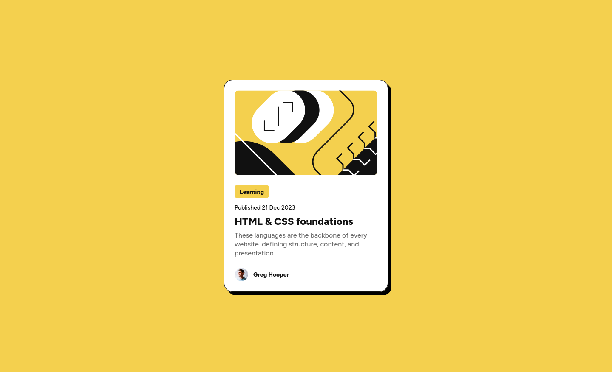

# Frontend Mentor - Blog preview card solution

This is a solution to the [Blog preview card challenge on Frontend Mentor](https://www.frontendmentor.io/challenges/blog-preview-card-ckPaj01IcS). Frontend Mentor challenges help you improve your coding skills by building realistic projects.

## Table of contents

- [Overview](#overview)
  - [The challenge](#the-challenge)
  - [Screenshot](#screenshot)
  - [Links](#links)
- [My process](#my-process)
  - [Built with](#built-with)
  - [What I learned](#what-i-learned)
  - [Continued development](#continued-development)
- [Author](#author)
- [Acknowledgments](#acknowledgments)

## Overview

### The challenge

Users should be able to:

- See hover and focus states for all interactive elements on the page

### Screenshot

### Links

- Solution URL: [Blog Review Card](https://github.com/Yakub357/blog-review-card.git)
- Live Site URL: [Blog Review Card](https://yakub357.github.io/blog-review-card/)

## My process

### Built with

- Semantic HTML5 markup
- CSS custom properties
- Flexbox
- CSS Grid
- Desktop-first workflow
- Hover effect
- Media Queries

### What I learned

I refreshed how to use @media-queries together with hover effect animations.
Building simple layout with flexbox and grid properties of CSS.

### Continued development

I would add more interaction animations besides hovering effect, e.g. fade-in animation when the page is just rendered and some other dynamic animations giving this card more life.

## Author

- Website - [JackEG](https://github.com/Yakub357)
- Frontend Mentor - [@JackEG](https://www.frontendmentor.io/profile/Yakub357)

## Acknowledgments

I would like thank Frontend Mentor team for organizing such a good pathway and well completed design file, which helped me to build frontend page with ease.
